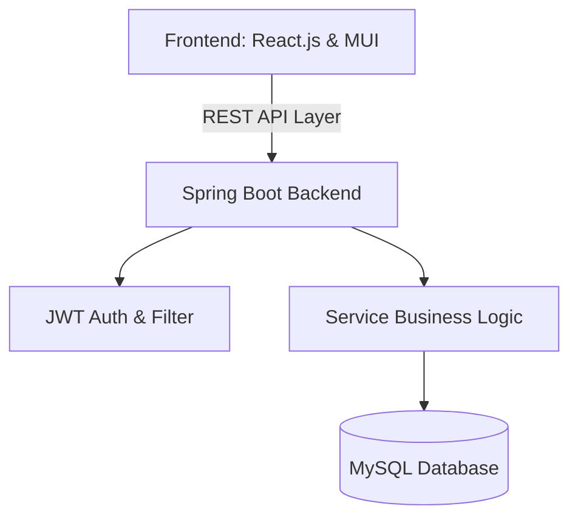
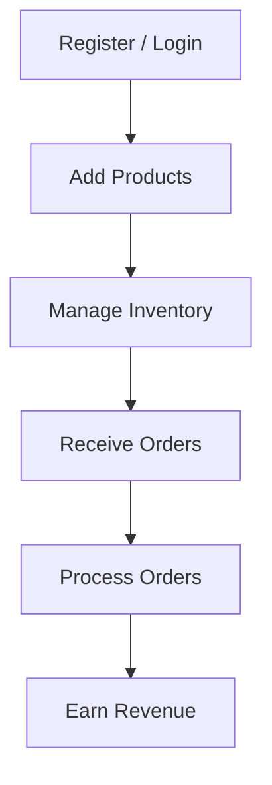
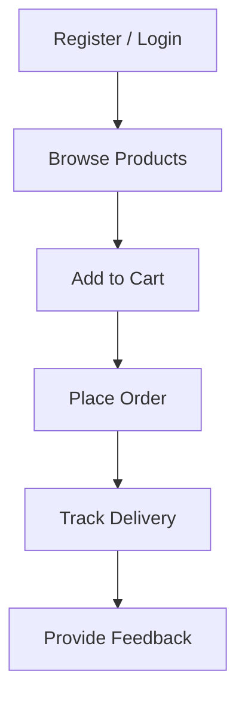
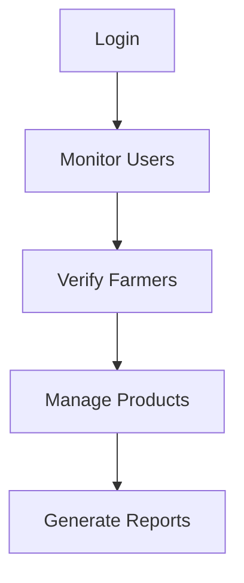

# 🌾 Uzhavan – Smart Digital Agriculture Marketplace

**Author:** Keerthana.S  
**Version:** 1.0.0  

---

## 📖 Project Overview
**Uzhavan** is a full-stack agriculture marketplace platform designed to connect farmers directly with consumers, eliminating unnecessary intermediaries and ensuring fair pricing for both parties. The platform enables farmers to showcase and sell their agricultural products, while customers can browse, purchase, and track fresh produce directly from local farmers.

The system also provides real-time market price tracking, order management, farmer-customer communication, secure authentication, and an administrative dashboard for monitoring platform activities.

---

## ⚠️ Problem Statement

### 👨‍🌾 Farmers often face challenges such as:
* **Dependence on middlemen**: Intermediaries take high commissions, reducing farmers' profits.
* **Lack of transparency**: No real-time access to actual market prices and demand information.
* **Limited digital reach**: Lack of access to modern digital marketplaces.
* **Price fluctuations**: Exploitation by local brokers and market traders.

### 🛒 Consumers also struggle to:
* Find fresh, quality farm produce at reasonable rates.
* Verify the origin and source of the produce they consume.
* Connect directly with local growers.

**Uzhavan** addresses these challenges through a transparent, technology-driven direct-to-consumer marketplace.

---

## 🎯 Objectives
* Connect local farmers directly with consumers.
* Ensure fair pricing through absolute market transparency.
* Provide real-time agricultural market insights.
* Improve farmers' income opportunities and sustainability.
* Create a secure, role-based, and user-friendly digital platform.
* Promote local agricultural growth and crop ecosystems.

---

## ✨ Key Features

### 👨‍🌾 Farmer Module
* **Farmer Registration & Login**: Secure signup with farm approval validations.
* **Product & Inventory Management**: List crops with prices, units, and track available stock levels.
* **Order Tracking**: Process incoming bookings and monitor shipping pipelines.
* **Market Price Tracker**: Access official district rates.
* **Announcements**: Publish crop posts and stories.
* **Profile & Settings Management**: Manage addresses, villages, and security preferences.

### 🛒 Customer Module
* **Product Browsing & Search**: Search fresh vegetables, fruits, grains, and pulses.
* **Add to Cart & Checkout**: Interactive shopping cart and secure order placement.
* **Order Tracking & Purchase History**: Monitor order progress and review past invoices.
* **Farmer Information View**: See farmer profiles and location details for trust validation.
* **Wishlist Management**: Save items to purchase later.

### 🛡️ Admin Module
* **Dashboard Analytics**: Real-time stats on registered users, total listings, and platform revenue.
* **User Management**: Approve and verify farmers, block/unblock accounts.
* **Product & Order Monitoring**: Monitor all live listings and transactions.
* **Market Data Management**: Feed official APMC district rates into the Price Tracker.

### 📈 Market Price Tracker
Provides official, updated guidelines:
* District-wise vegetable prices
* Fruit price monitoring
* Pulses and grains market rates
* Daily market updates and price trend analysis
* Farmer selling recommendations (e.g., Hold stock / Sell immediately)

---

## 💻 Technology Stack

### Frontend
* **Core**: React.js (Vite environment)
* **Styling**: Material-UI (MUI)
* **Routing**: React Router DOM
* **State Management**: Redux Toolkit / Context API
* **Client Requests**: Axios (with custom interceptors)

### Backend
* **Core**: Java (Spring Boot framework)
* **Security**: Spring Security + JWT (JSON Web Tokens)
* **Persistence**: Hibernate ORM / Spring Data JPA
* **Build Tool**: Maven

### Database
* **Server**: MySQL Server
* **Authentication**: Role-Based Access Control (RBAC)

### Deployment
* **Frontend**: Vercel / Netlify
* **Backend**: Render / Railway / AWS
* **Database**: MySQL Server Cloud Instance

---

## 📐 System Architecture

---

## 🔄 Project Workflows

### Farmer Flow

### Customer Flow

### Admin Flow

---

## 🗄️ Database Modules

### 👥 Users
* `User ID` (Primary Key)
* `Name`
* `Email`
* `Phone Number`
* `Role` (ADMIN, FARMER, CUSTOMER)

### 🌾 Farmers
* `Farmer ID`
* `Farm Details`
* `Address` & `Village`
* `Approval Status`

### 🍎 Products
* `Product ID`
* `Product Name`
* `Category` (Vegetables, Fruits, Grains, Pulses)
* `Quantity` & `Unit` (kg, bundle, piece)
* `Price`
* `Stock Status` (Available/Unavailable)

### 📦 Orders
* `Order ID`
* `Customer ID`
* `Farmer ID`
* `Ordered Quantity`
* `Total Price`
* `Order Status` (PENDING, CONFIRMED, SHIPPED, DELIVERED, CANCELLED)
* `Payment Status`

### 📊 Market Prices (District Price Index)
* `Product Name`
* `District`
* `State`
* `Min Price`
* `Max Price`
* `Average Price`
* `Updated Date`

---

## 🔒 Security Features
* **JWT Authentication**: Secure stateless authentication token on every API call.
* **Password Encryption**: Encrypted credentials stored using BCrypt.
* **Role-Based Authorization**: Distinct access levels for admin, farmer, and customer endpoints.
* **Input Validation**: Strict request payload validation bounds.
* **Session Management**: Secure storage of active sessions.

---

## 🚀 Future Enhancements
* **AI-Based Crop Recommendation**: Suggest optimal selling periods.
* **AI Demand Prediction**: Predict high-demand periods for price optimization.
* **Weather Forecast Integration**: Inform crop harvesting decisions.
* **Multilingual Support**: Support local languages like Tamil.
* **Mobile Application**: Native Android/iOS builds.
* **Live Chat**: Connect farmers and customers directly via text.
* **Digital Payment Gateways**: Integrate Unified Payments Interface (UPI).
* **Smart Logistics Tracking**: Live GPS delivery tracking.
* **Government Scheme Notifications**: Alert farmers of new agricultural subsidies.

---

## 🌟 Expected Impact
* **Increased Farmer Profits**: Direct access to customers increases profit margins by 20-30%.
* **Elimination of Middlemen**: Removes price manipulations.
* **Better Price Transparency**: Empowers decision-making using APMC district price sheets.
* **Improved Consumer Trust**: Clear details of farm origin.
* **Sustainable Growth**: Cultivates a stronger, fairer local agricultural ecosystem.
